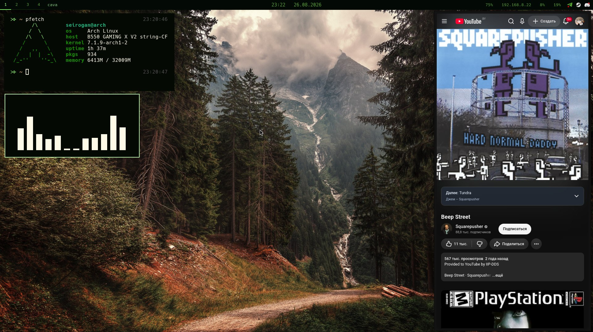

# Seirogan's dotfiles for niri

## How to install

### Install the GNU stow by
##### On Arch :
        `sudo pacman -S stow`

### Make the dotfiles dir
- On the home dir
        ` mkdir .dotfiles `

### Switch to this dir 
        ` cd ~/.dotfiles `

### Clone this repo
        ` git clone https://github.com/boleetem/arch-dotfiles `

### Move all directories in the directory "arch-dotfiles"
###                    to the ~/.dotfiles
> So it will be like ~/.dotfiles/.config/

### Enter to the ~/.dotfiles and use GNU stow
        ` stow . `

## U Done !

        
